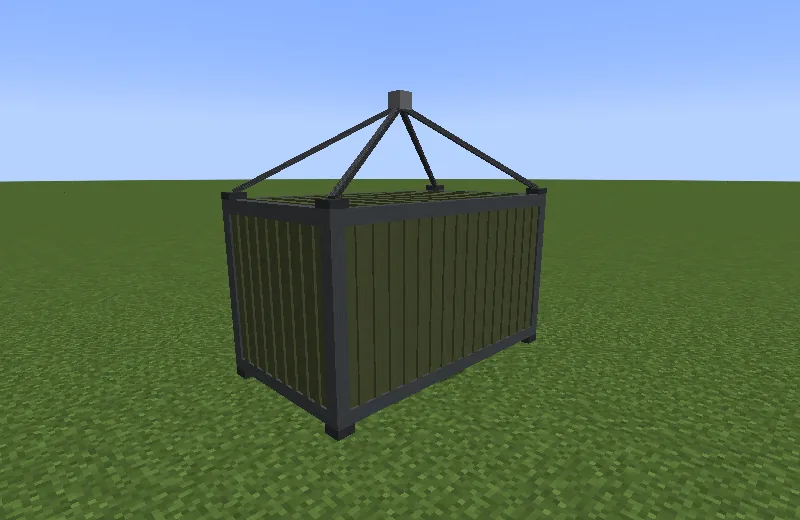
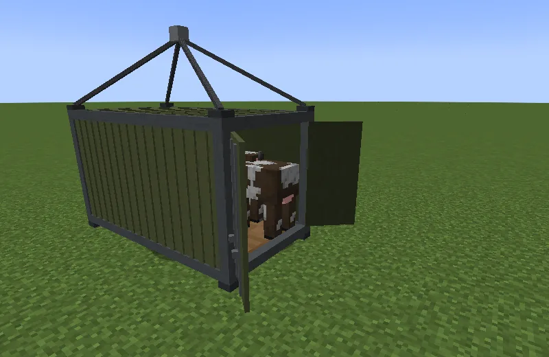
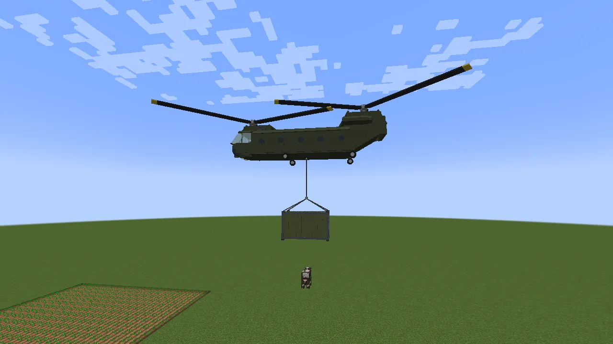
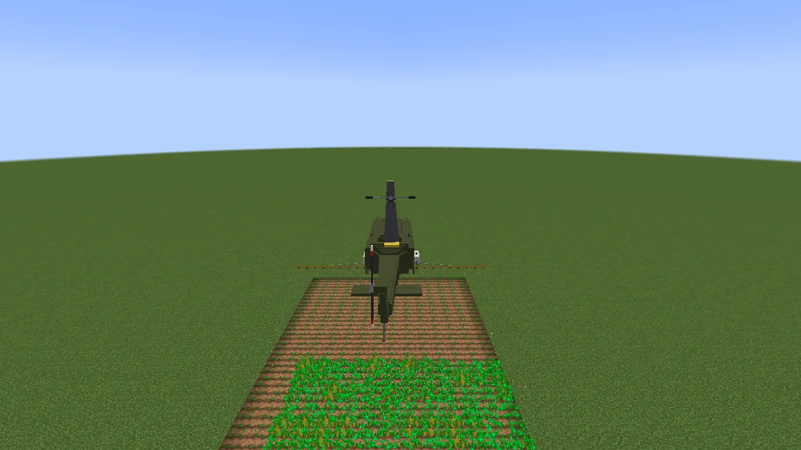

**Rotorcraft** is how every helicopter on the server flies: the [Huey](/wiki/huey) and the
[Chinook](/wiki/chinook) are Rotorcraft helicopters. It also adds the **Sling Container**, a steel
box you load on the ground and carry under a helicopter on a rope, and the **Crop Sprayer**, which
bone-meals a whole field from the air. Helicopters are vehicles like the cars, so keys, fuel, paint
and repairs work as on [Vanilla Wheels](/wiki/vanilla-wheels).

## Flying

Get in and you're the pilot (the right-hand seat; anyone else rides). The rotor has to spin up for a
few seconds before it will lift off.

| Key | What it does |
|---|---|
| **W / S** | fly forward / back |
| **A / D** | turn |
| **Space** | climb |
| **Left Shift** | descend |
| **R** | get out |
| **G** | hook or let go a load |
| **V** | crop sprayer on / off |
| **H** | lights |

The keys only work while you're in a helicopter. You can change them in Controls: climb, descend
and get out are *Up*, *Down* and *Get out* under *Vanilla Wheels* (every vehicle that flies or dives
shares them), the hook and the sprayer are under *Rotorcraft*. Things to know:

- **Let go of everything and it hovers** in place.
- **Holding Shift always lands softly.** It slows down by itself near the ground, from any height.
- **Nobody aboard is ever hurt by flying.** Not by landing, not by crashing, not by falling.
- **Crashing damages the helicopter**, though: flying into a wall or a roof fast, or hitting the
  ground faster than a soft landing. Repair it like any vehicle.
- **Wrecked in the air**, it comes down first, then it's packed into a broken item where it lands.
  **Set a broken one down and repair it**: it stays where you put it, but it won't fly until it's
  repaired. Right-click it (each click costs a little hunger) or put it on a Mechanic Lift.
- **Out of fuel in the air**, it glides down slowly on its spinning rotor and lands.
- **You can only get out (R) within three blocks of the ground.** Shift never drops you out. You
  step down to the ground beside your seat, out of your own side's door (the other side's, if a
  wall is in the way).
- **The rotor blades pass through trees and walls** without harm; only the body bumps into things.
- **But spinning blades cut down anything alive they touch**: a bird you fly into, a mob, a
  player who jumps into them. At full speed a strike kills a chicken or a cow and takes up to
  half a player's health. Nobody aboard is ever hit. Keep clear of the Huey's tail rotor: its
  lowest sweep is at head height.

## The Sling Container

**Crafting:** a chain on top, then a steel ingot, a chest and a steel ingot, then three steel
ingots:

| | | |
|---|---|---|
| | chain | |
| steel ingot | chest | steel ingot |
| steel ingot | steel ingot | steel ingot |

Put it down like a vehicle. It holds **four grown animals** (or eight young) and has **two chests**
inside. **Crouch and right-click its doors** with an empty hand to open them, and right-click it
holding a lead to lead animals in, as with the Trailer.

**Carrying it:** hover over it until the hook under the helicopter is just above the container's
ring, and press **G**. Climb and it lifts off on its rope and swings along behind you. Hold **Shift**
to set it down softly; the helicopter stops just above it. Press **G** again to let go (only once
it's on the ground). On the ground, crouching and right-clicking its ring empty-handed also lets it
go. Animals in it are never hurt.

## The Crop Sprayer

**Crafting:** iron bars, a hopper and iron bars, then two dispensers below the bars:

| | | |
|---|---|---|
| iron bars | hopper | iron bars |
| dispenser | | dispenser |

**Right-click a helicopter** with it to fit it (a crouching empty-handed click on the boom takes it
off again, and gives back its bone meal). Then **right-click the helicopter with bone meal** (or bone
blocks, worth nine each) to fill its tank, up to 256.

Fly low over your crops, **within twelve blocks**, and press **V**. Everything the boom passes over
gets **one bone meal per crop**, as if you'd used it by hand; it won't dose the same crop again for
two seconds, so hovering doesn't empty the tank on one row. The Huey's boom is eleven blocks wide,
the Chinook's fifteen. It sprays only where you're allowed to build, and in creative it's free.

